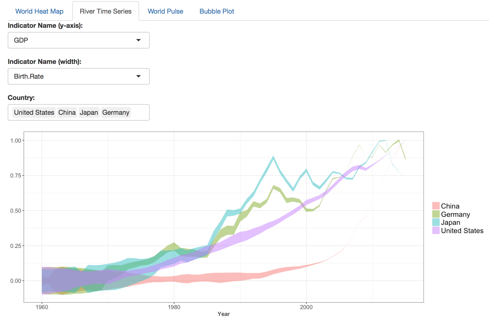
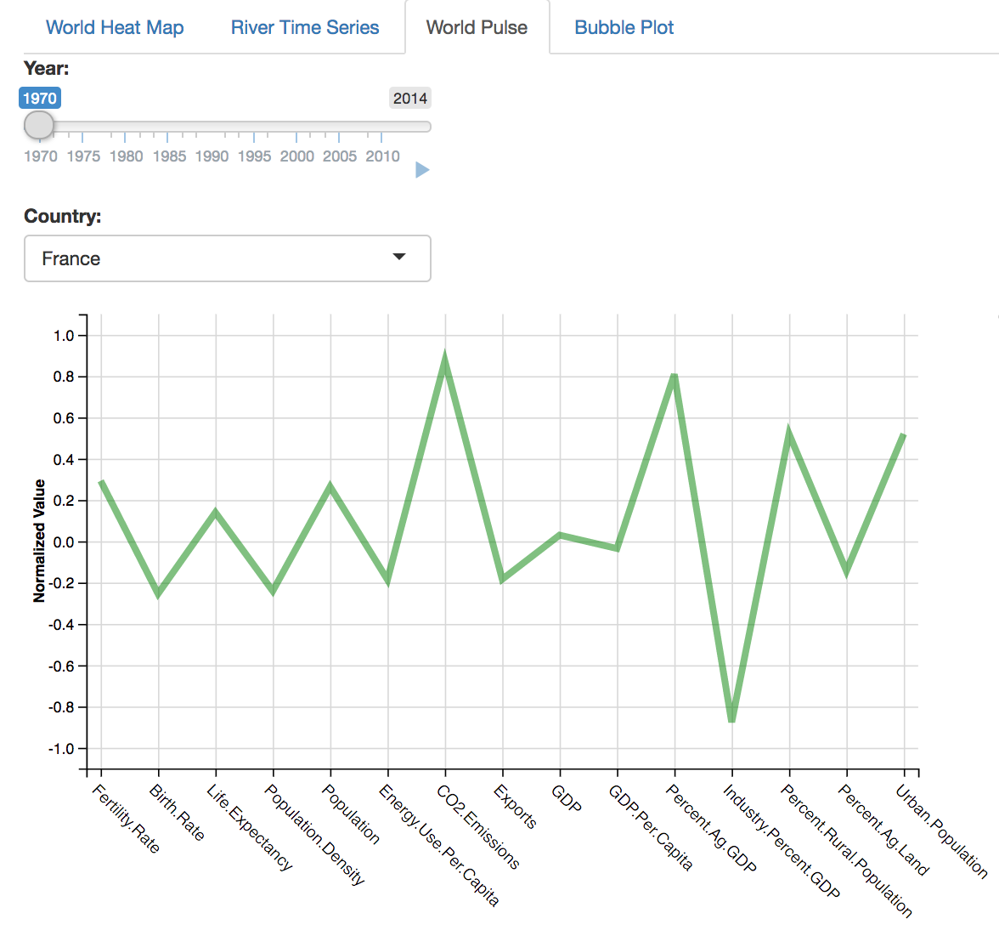
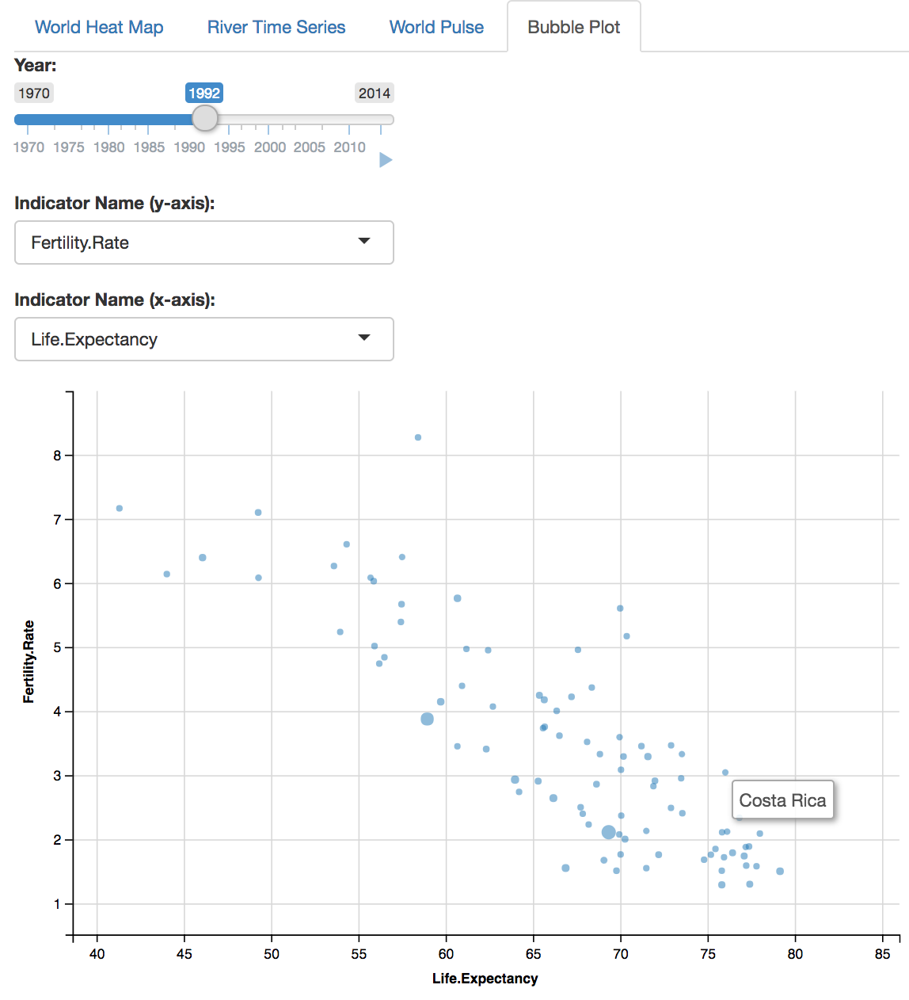

# Team k-words: Data Vis Project

Jinxin Ma - jma33@usfca.edu
Will Young - wjyoung@usfca.edu

## Dataset

We gathered the data set from worldbank.org. It includes several economic, health, natural resource, and social indicators in each country in the world beginning in 1960. Much of the data is missing for many indicators in many countries, and using all of the indicators would be cumbersome. We thus decided to use a subset of the variables with more complete data and relevance.

## Plot Descriptions

In the fianl deliverables we present four plots, a heatmap on a world map, a "ribbon time series", a "world pulse plot", and a bubble plot. The world-heat map displays countries in different shades or colors depending on the value of the selected variable. Users can hover on a country and a tooltip will pop up showing the value of the selected variable. 

The ribbon time series is to show two variables simultaneously changing over time in a single line. The height on the y-axis of of the line indicates the value of one variable at time $x$ while the width of the ribbon indicates the value of the second variable at time $x$. The non-time variables are all normalized so the minimum vaues is zero and the maximum is one. This allows the width and height to be simultaneously meaningful, but when two countries are displayed simultaneously we cannot compare the values of the variables between the two countries only the change of the variables.

The idea of the world pulse plot is to plot several variables, for one country at a time, in a modified parallel coordiate plot and animate the plot through time. The primary modification is the variables alternate between moving between zero and positive one and zero and negative one. The sign of the variable is not relevant, only the magnitude. We will group similar variables next to each other on the plot. So economic inidcators are on the left, health indicators in the middle, and environmental indicators are on the right (for example). Hopefully as the animation loops we will see different varaibles pulse in some sort of pattern. Our early observations are that this may only work for particular varaibles, and will only look neat when those variables are cyclical.

The last plot is a bubble plot. Users can select any two variables and plot one versus the other for all countries. The animation shows how the relationship between the two variables change over the years.

## UI

Each plot will be displayed in its own tab each tab having its own set of interactions. The heat map will allow the user to select the variable that controls the color. The river time series will allow the user to select countries ot display and two variables to compare. The pulse plot will allow the user to select the country. 
